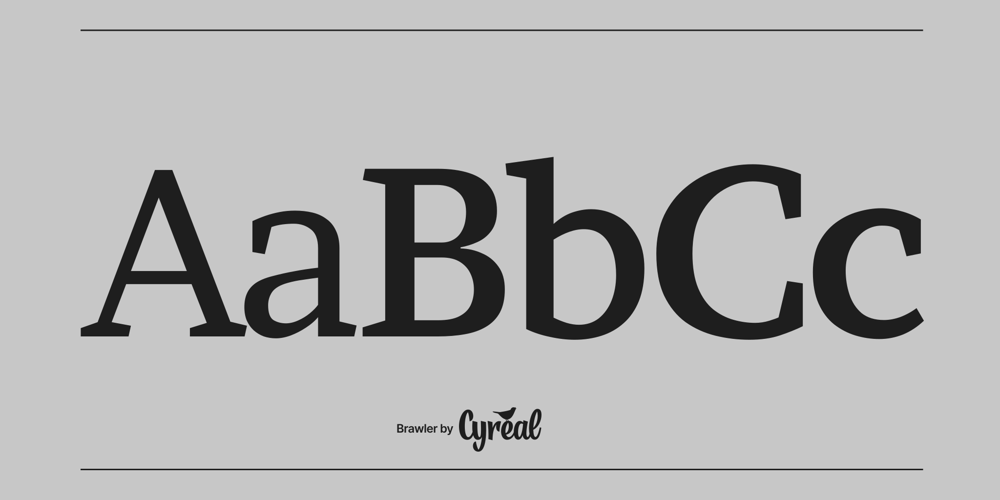

# Brawler

  <picture>
    <source media="(prefers-color-scheme: dark)" srcset="./documentation/slide1-dark.svg">
    <source media="(prefers-color-scheme: light)" srcset="./documentation/slide1-light.svg">
    
  </picture>
  <a href="https://cyreal.org/fonts/brawler">Website</a> |
  <a href="https://fonts.google.com/specimen/Brawler">Google Fonts</a>

## About 

Brawler is a compact typeface with sharp features and a sturdy character, designed for comfortable reading in small sizes. It was initially planned as a typeface for newspapers and tabloids. Thus, the design concept was shaped by the demands of low quality printing media and the aesthetic preferences of periodical publications.

Brawler is a Unicode typeface family that supports 
languages that use the Latin script and its variants, and 
could be expanded to support other scripts.

## Building

Fonts are built automatically by GitHub Actions - take a look in the "Actions" tab for the latest build.

If you want to build fonts manually on your own computer:

- `make build` will produce font files.
- `make test` will run [FontBakery](https://github.com/googlefonts/fontbakery)'s quality assurance tests.
- `make proof` will generate HTML proof files.

The proof files and QA tests are also available automatically via GitHub Actions - look at `https://cyrealtype.github.io/Brawler`.

## Changelog

In December 2013 [Haley Fiege](https://www.haleyfiege.fun/fonts/) has contributed a design of the Bold version.

## License

This Font Software is licensed under the SIL Open Font License, Version 1.1.
This license is available with a FAQ at https://openfontlicense.org

## Repository Layout

This font repository structure is inspired by [Unified Font Repository v0.3](https://github.com/unified-font-repository/Unified-Font-Repository), modified for the Google Fonts workflow.