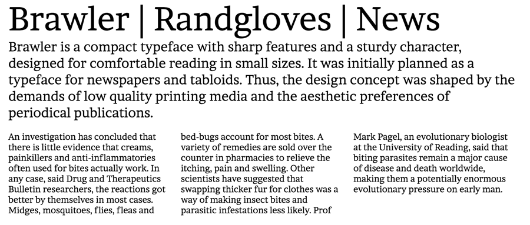

Brawler is a compact typeface with sharp features and a sturdy character, designed for comfortable reading in small sizes. It was initially planned as a typeface for newspapers and tabloids. Thus, the design concept was shaped by the demands of low quality printing media and the aesthetic preferences of periodical publications.

Brawler is a Unicode typeface family that supports 
languages that use the Latin script and its variants, and 
could be expanded to support other scripts.

